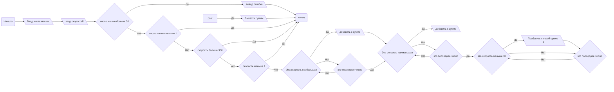

Блок-схема для кода:

```mermaid
flowchart LR
A(Начало) --> B[\Ввод числа машин\]
B --> C[\ввод скоростей\]
C --> d{число машин больше 30}
d-->|да|e[\вывод ошибка\]
d-->|нет|f{число машин меньше 1}
e-->p(конец)
    f-->|Да|p
    f-->|Нет|l{скорость больше 300}
    l-->|Да|p
    l-->|нет|k{скорость меньше 1}
    k-->|Да|p
    k-->|Нет|M{Эта скорость наибольшая}
    M -->|Да| K[\ добавить к сумме\]
    M -->|Нет| T{это последнее число}
    T -->|Нет| M
    T -->|Да| Min{Эта скорость наименьшая}
    K-->Min
    Min -->|Да|r[\ добавить к сумме\]
    Min -->|Нет|R{это последнее число}
    R -->|Нет| Min
    R -->|Да| O{эта скорость меньше 30}
    O -->|Да| Prib[\Прибавить к новой сумме 1\]
    O -->|Нет| posl{это последнее число}
    Prib --> posl{это последнее число}
    posl -->|Нет| O
    post -->|Да| viv[\Вывести суммы\]
viv -->p
```